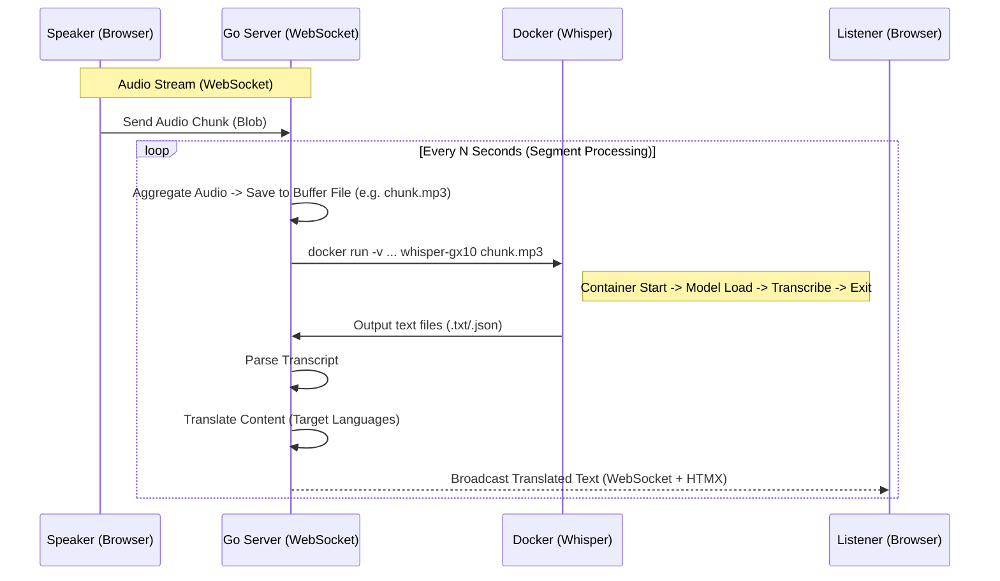

# Real-time Speech Translation System Architecture

## 1. System Overview
This system enables "near real-time" speech-to-text and translation by streaming audio from a speaker's browser to a Golang backend. The backend utilizes the specific Dockerized Whisper container for transcription as requested. The processed text is then translated and broadcast to listeners' browsers in their selected languages.

## 2. Architecture Diagram



## 3. Core Components

### A. Frontend: Speaker Client
*   **Role**: Captures microphone input and streams it to the server.
*   **Tech Stack**:
    *   **HTML5/JS**: `MediaRecorder` API for capturing audio segments.
    *   **WebSocket**: For low-latency transmission of binary audio data to Go.
    *   **HTMX**: For connection control (Start/Stop).

### B. Backend: Golang Server
*   **Role**: Pipeline orchestration.
*   **Modules**:
    *   **WebSocket Hub**: Manages connections.
    *   **Audio Ingestor**: Receives stream, handles buffering.
    *   **Segmenter**: Cuts the stream into files (e.g., `seq_1.mp3`, `seq_2.mp3`) suitable for the Docker command.
    *   **Docker Executor**: Wraps `os/exec` to run the specific `docker run` command provided.
        *   *Command Construction*: `docker run --rm -v [abs_path_to_data]:/app whisper-gx10 [filename] --model medium --language Chinese --output_dir /app`
    *   **Translator**: 
        *   Since Whisper (Standard) translates to English, if listeners want other languages (e.g., German), a secondary translation step is needed.
        *   *Library*: `github.com/bregydoc/gtranslate` (Free Google Translate wrapper) or `golang.org/x/text` (Limited) or an external API.
        *   *Default*: We can rely on Whisper for Chinese->English, and use a library for English->Others.

### C. Frontend: Listener Client
*   **Role**: Interface for audience members.
*   **Tech Stack**:
    *   **HTMX**: Swaps content dynamically when WebSocket messages arrive.
    *   **WebSocket extension**: Listens for payloads like `{"text": "Hello", "lang": "en"}`.

## 4. Latency & Constraints
*   **Docker Overhead**: The requirement to use `docker run` for every segment introduces latency (Container startup + Model loading).
    *   *Estimated Latency*: 5-10 seconds per phrase.
    *   *Mitigation*: We will buffer audio into reasonable chunks (e.g., 5-10 seconds) to ensure the processing time is worth the overhead.

## 5. Technology Stack
*   **Backend Language**: Golang (1.20+)
*   **Web Framework**: Standard `net/http` or `Chi` / `Echo` (Standard is sufficient).
*   **Transport**: WebSockets (`github.com/gorilla/websocket`).
*   **Frontend**: HTML5, CSS (Tailwind or Vanilla), HTMX 2.0.
*   **AI/Processing**: Docker Engine, Whisper Image `whisper-gx10`.
*   **Translation**: Google Translate unofficial API (for demo) or DeepL/OpenAI API (for production).

## 6. Directory Structure
```
/realtransfer
├── cmd
│   └── server
│       └── main.go        # Application Entry
├── internal
│   ├── audio              # Audio buffering logic
│   ├── docker             # Wrapper for Docker command
│   ├── translate          # Translation service
│   └── ws                 # WebSocket hub
├── web
│   ├── static             # CSS/JS
│   └── templates          # HTML Templates
└── data                   # Temp folder for audio/text
```
